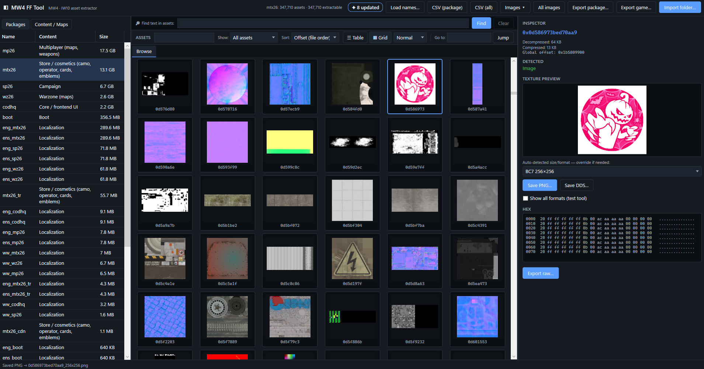

<h1 align="center">MW4 Asset Tool</h1>

<p align="center">
  A native Windows desktop toolkit for browsing, decoding, and extracting current-generation
  Call of Duty (IW 10.0 engine) asset packages — fully offline, read-only, static file analysis.
</p>

<p align="center">
  <a href="https://github.com/SaveEditors/mw4-asset-tool/releases">Downloads</a> ·
  <a href="docs/FORMAT.md">Format Reference</a> ·
  <a href="CHANGELOG.md">Changelog</a> ·
  <a href="https://github.com/SaveEditors/mw4-asset-tool/issues">Support</a>
</p>

<p align="center">
  
</p>

Open `MW4AssetTool.exe` for the desktop workspace, point it at your game directory, and browse
every asset in the game's `KAPI` packages. The tool decompresses on-disk data (Oodle / LZ4),
decodes textures (BC1–BC7 and uncompressed), and exports to PNG and DDS — without ever
launching, patching, or injecting into the game.

> **Read-only and offline.** MW4 Asset Tool never runs the game, never touches game memory,
> and never interacts with anti-cheat. It only reads files you already own on disk.

> **Beta (0.9.7).** This is an early release. Extraction and decompression are solid, and
> texture format auto-detection is much improved and now **learns from your corrections** —
> but it is still a heuristic on headerless data, so some textures need the manual **show all
> formats** override, and per-asset names are not resolved (assets are shown by hash). See
> [Scope and Limitations](#scope-and-limitations).

## Install

MW4 Asset Tool is a self-contained x64 Windows desktop application. Windows 11 is recommended;
see [Requirements](#requirements) for supported Windows 10 editions.

| Package | Choose it for | System behavior |
| --- | --- | --- |
| **Portable ZIP** — `MW4AssetTool-0.9.7-beta-win-x64.zip` | A movable, self-contained folder | Extract and run `MW4AssetTool.exe`. Performs no installation and makes no `PATH` changes. Thumbnail cache lives under `%LOCALAPPDATA%\MW4FFTool`. |
| **Build from source** | Developers and contributors | Requires the .NET 10 SDK. See [Build from source](#build-from-source). |

> **Unsigned release:** MW4 Asset Tool is intentionally unsigned. Windows may display
> **Unknown Publisher** or a SmartScreen warning. Verify the matching `.sha256` file from
> the Releases page before running.

```powershell
Get-FileHash .\MW4AssetTool-0.9.7-beta-win-x64.zip -Algorithm SHA256
Get-Content .\MW4AssetTool-0.9.7-beta-win-x64.zip.sha256
```

The hash printed by `Get-FileHash` must match the value in its downloaded checksum file.

## Quick Start

1. Launch `MW4AssetTool.exe`.
2. Click **Import folder…** and select your Call of Duty game directory (the folder that
   contains the `.xpak` / `.xsub` packages).
3. Pick a package — for example `mtx26` (store cosmetics) or `codhq` (core / frontend).
4. Switch to the **Grid** view to browse decoded thumbnails, or the **Table** view to sort
   and search by hash and address.
5. Select any asset to inspect it, then **Export** it — or use **Export images** to batch
   every decoded texture in the package (or the whole game) to PNG + DDS.

`oo2core_8_win64.dll` ships with the game and is located automatically from the directory
you select — no separate download is required.

## Capabilities

The tool groups its work into the following families.

| Family | What it covers | Typical work |
| --- | --- | --- |
| Package browsing | `KAPI` `.xpak` index + `.xsub` data, all on-disk object layouts | Index a game directory and browse every asset by package |
| Decompression | Oodle and LZ4 block decompression, headerless-blob handling | Reconstruct wrapped, raw, and headerless assets from disk |
| Texture decode | BC1–BC7 and uncompressed R8 / RG8 / RGBA8 → RGBA | Render coherent thumbnails and full-resolution previews |
| Format detection | Best-guess interpretation (crop score + block-seam check + learned prior), with a manual override | Resolve headerless textures; confirmations feed back into detection |
| Image export | PNG and DX10 DDS, single asset / package / whole game | Extract art to open directly in Photoshop, GIMP, or PIL |
| Fastfile tools | `.ff` (`IWffa100`) header inspection and Oodle zone decompression | Inspect and export decompressed fastfile zones |
| Browsing & search | Virtualized 100k+ row tables, hash / text search, category and UI-role filters | Find loading screens, compass, emblems, cards, and icons by shape |
| Navigation | Jump-to-address tabs, sortable columns, right-click copy / jump | Move through large packages by offset and hash |
| Name resolution | Import a `hash → name` list (CSV / TXT / JSON) | Label assets when a dictionary is available |
| Update tracking | Automatic per-launch catalog snapshot + diff | See exactly which assets a game patch **added / changed / removed**, and filter to them |
| Catalog export | CSV manifest of the loaded package or game | Produce an inventory of every asset |

## In This Beta

- A production WPF / MVVM desktop workspace (dark theme) with a virtualized asset table at
  100k+ rows and a background-preloaded, disk-cached thumbnail grid that stays smooth while
  scrolling large packages.
- A complete `KAPI` package reader (`.xpak` index + `.xsub` data) that handles every on-disk
  object layout — wrapped, raw, and headerless — with Oodle and LZ4 block decompression.
- BC1–BC7 and uncompressed texture decoding, with best-guess interpretation scored on a
  contiguous crop (with a BCn block-seam check) so the thumbnail grid and inspector preview
  always agree, plus a manual "show all formats" override.
- **Detection that learns from you** — every interpretation you confirm in the "show all
  formats" tool feeds back into auto-detection for textures of that size, so accuracy improves
  as you use it. On an internal labeled test, format-and-dimension recovery on decidable cases
  rose from ~65% to near-perfect; real textures with alpha and normal maps remain harder.
- Single, per-package, and whole-game image export to PNG and valid DX10 DDS, plus raw asset
  and decompressed fastfile zone export and a CSV catalog manifest.
- A Content / Maps catalog derived from readable fastfile names, hash and text search,
  category and UI-role filters, sortable columns, jump-to-address tabs, and a `hash → name`
  importer for labeling assets when a dictionary is available.
- A self-contained `win-x64` runtime target that runs without a separate .NET installation.

## Requirements

- x64 Windows 11 is recommended. On Windows 10, Microsoft supports .NET 10 only on eligible
  Enterprise and LTSC releases; see the current
  [.NET support matrix](https://learn.microsoft.com/dotnet/core/install/windows#supported-versions).
- `oo2core_8_win64.dll`, which ships with the game and is located automatically from the
  selected directory.
- A local Call of Duty (IW 10.0) install containing the `.xpak` / `.xsub` packages you want to
  browse.

## Build from source

```powershell
dotnet build MW4AssetTool.slnx
dotnet run --project src/FFTool.App/FFTool.App.csproj
```

Produce the self-contained portable release (the ZIP published on the Releases page):

```powershell
dotnet publish src/FFTool.App/FFTool.App.csproj -c Release -r win-x64 --self-contained -o dist/MW4FFTool
```

### Project layout

| Project | Role |
| --- | --- |
| `FFTool.Native` | Oodle P/Invoke (`oo2core_8`) |
| `FFTool.Formats` | `KAPI` package reader, fastfile decompressor, BCn / texture decode, catalogs |
| `FFTool.App` | WPF / MVVM UI (dark theme) |

## Scope and Limitations

This is a **beta**. The two biggest known limitations are inherent to static, offline
analysis of this engine generation — not bugs that a patch will fully close:

- **Texture format auto-detection is a heuristic.** Packaged pixel data is headerless (no
  stored dimensions or format), so the tool infers them from the blob and scores a best guess.
  Detection is much improved over early builds and **learns from your confirmations** — each
  correction made in the **show all formats** tool is logged locally and fed back into
  detection for textures of that byte size. It is still not perfect: some formats (e.g. a
  colour image that is a valid BC1 / BC3 / BC7 decode) are genuinely ambiguous from pixels
  alone, so the manual override remains the ground truth.
- **Per-asset names are not resolved.** Assets are keyed by **hash**, not name. Human-readable
  names live in the fastfile string tables, which the game resolves at runtime; recovering
  them statically is not possible on this engine. The tool shows hashes and can import a
  `hash → name` list to label them; map and content-level names are derived from readable
  fastfile filenames.
- **GSC scripts, audio, and video are not extractable.** They are hash-keyed and
  runtime-linked, not stored as embedded standard files, so static analysis cannot recover
  them.

See [docs/FORMAT.md](docs/FORMAT.md) for the reverse-engineered container format details.

## Support and Contributing

- Open a [GitHub issue](https://github.com/SaveEditors/mw4-asset-tool/issues) for bugs and
  questions. Never place personal files or account details in a public issue.
- MW4 Asset Tool is licensed under the [MIT License](LICENSE).
